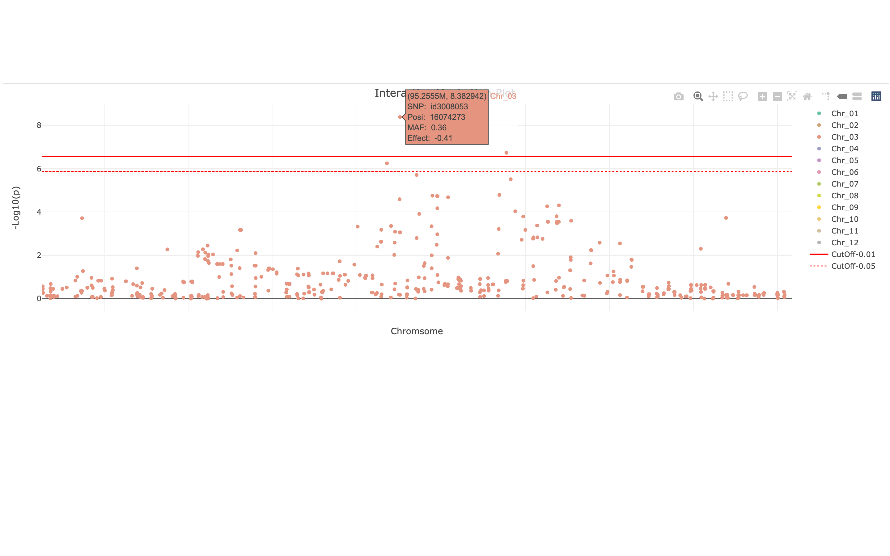
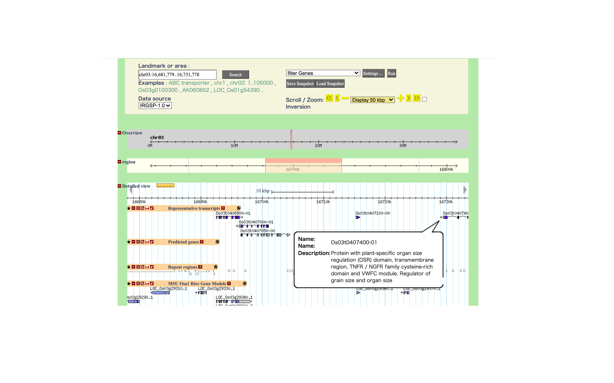

```{r setup, include=FALSE}
knitr::opts_chunk$set(echo = FALSE)
```

## Dataset: Rice 44k genomes 

- Data from Zhao et al. (2011) Nature Communications 2:467
- Data available at http://www.ricediversity.org/data/
- 34 agronomic traits were examined for 413 rice accessions  


## Download source codes and input data

- GAPIT_practice.R  
- RiceDiversity_44K_Genotypes_PLINK_imputed.txt.gz  
- RiceDiversity_44K_Genotypes_PLINK_info.txt  
- All available at https://github.com/yassato/BIO373/tree/main  


## What to do in this practice

- GWAS example: Find genomic region associated with the seed length
- GS example: Predict flowering time between different study years
- Finally, you will be able to try GWAS/GS for traits of your interests!


## First of all, load Genomic Association and Prediction Integrated Tool (GAPIT)

\tiny
```{r load_GAPIT, eval = FALSE, echo = TRUE}
# download GAPIT source code
# if errors happen, try twice to load
source("https://zzlab.net/GAPIT/gapit_functions.txt")
```


## Load and see phenotype data

\tiny
```{r load_pheno, echo = TRUE}
pheno_url <- "http://www.ricediversity.org/data/sets/44kgwas/RiceDiversity_44K_Phenotypes_34traits_PLINK.txt"
p <- read.table(pheno_url, sep="\t", header=TRUE)
nrow(p) # no. of plants
head(p)
```


## Read genotype data and marker information

\tiny
```{r load_geno, echo = TRUE, eval = TRUE}
g <- read.table("RiceDiversity_44K_Genotypes_PLINK_imputed.txt.gz",
                header=TRUE, sep="\t")
gm <- read.table("RiceDiversity_44K_Genotypes_PLINK_info.txt.gz",
                 header=TRUE, sep="\t")
nrow(g) # no. of plants
ncol(g[,-1]) # no. of SNPs
head(gm) # marker info
```


## (1) Genome-wide association study (GWAS)


## Aim: Looking for genomic region underlying the length of rice grains

- Indica cultivars have long grains, while Japonica have round-shaped grains   
- *Grain Size 3* (*GS3*) is known to regulate the seed length in rice (Wang et al. 2011 TAG)
- Can we detect the known loci with GWAS?   


## Run GWAS with a general linear model (GLM) or mixed linear model (MLM)

- It takes several minutes. Wait.
- When finished, output files appear in the current directory

\tiny
```{r GLM, echo = TRUE, eval = FALSE}
myGAPIT <- GAPIT( # warnings occur but it still works
  Y=p[,c("HybID","Seed.length")],
  GD=g,
  GM=gm,
  SNP.MAF=0.05, # cut-off minor alleles at 0.05
  Inter.Plot=TRUE,  # option to make interactive plots
  model=c("GLM", "MLM"),
  Multiple_analysis=TRUE)
```


## GWAS is done. Let us see a trait diagnosis first

{width=80%}

- The seed length looks normally distributed


## ... and also check heritability in the seed length

{width=80%}

- Heritability, $h^2 = \sigma^2_g / (\sigma^2_g + \sigma^2_e)$,
- where $\sigma^2_g$: genetic variance; $\sigma^2_e$: residual variance
- $h^2$ (%) is calculated as $100*(\sigma^2_g/(\sigma^2_g+\sigma^2_e))=100*(0.91/(0.91+0.01))=98.8\%$


## Check LD to see what kbp we should refer around the SNPs.

{width=80%}

- The length of linkage disequilibrium is at most 600 kbp.


## Compare the marker density with the LD length  

{width=80%}

- The marker intervals are much shorter than the length of LD,
- indicating that marker density was enough


## Manhattan plot of the general linear model (GLM)  


- Is everything significant?? Very difficult to find key variants...


## Quantile-quantile (QQ) plot also shows inflated $p$-values

{height=50%}

- Blue dots: Observed -log~10~($p$-values)  
- Red line: Expected -log~10~($p$-values) when they are random      


## Manhattan plot of the mixed linear model (MLM) 


- We can find a peak on the chromosome 3!  


## QQ plot of the mixed linear model

{height=50%}

- Only for top-scoring SNPs, -log~10~($p$-values) are higher than expected  


## GWAS works well. Check the position of top-scoring SNPs


- Open "Interactive.Manhattan.MLM.Seed.length.html"  
- You can focus on the chromosome 3 in the interactive plots  


## What genes are located nearby? Check the database

- Access RAP-DB website at https://rapdb.dna.affrc.go.jp/  
- GBrowse -> Translate into English (by Google)  
- Input genome region in "Landmark or area" -> Click "search"  

{width=120%}


## (2) Genomic selection (GS)


## Aim: Prediction of the flowering time in rice cultivars

- Flowering time, or heading date in rice, was recorded at Arkansas on 2006 and 2007 (Zhao et al. 2011)  
- Genotypes were same but environment should be different between years  
- The flowering time of some accessions were unavailable  
- Can we predict the flowering time only on the basis of genotypes?  


## Estimate a trait value of each plant with gBLUP

- When finished, output files appear in the current directory

\tiny
```{r gBLUP, echo = TRUE, eval = FALSE}
# gBLUP for the flowering time 2006 at Arkansas
myGAPIT_BLUP <- GAPIT( #warnings occur but it still works
  Y=p[,c("HybID","Year06Flowering.time.at.Arkansas")],
  GD=g,
  GM=gm,
  SNP.MAF=0.05,
  model="gBLUP")
```


## We get BLUP, PEV, BLUE, and predicted trait values

- BLUP: Best Linear Unbiased Predictor shows trait variance around mean 
- PEV: prediction error variance of BLUP
- BLUE: Best Linear Unbiased Estimator shows mean differences of traits
- BLUP + BLUE = Prediction

\tiny
```{r pred, echo = TRUE, eval = TRUE}
# load results of genomic prediction
pred <- read.csv("GAPIT.MLM.Pred.result.csv")
head(pred)
```

## Of course, predicted flowering time is well correlated with observed values

\tiny
```{r fitting, echo = TRUE, eval = TRUE}
# align predicted and observed traits following the taxa name
pred <- pred[order(pred$Taxa),]
y <- p[order(p$HybID),]

# Pearson's correlation between predicted and observed flowering
cor.test(pred$Prediction, y$Year06Flowering.time.at.Arkansas)
```


## Predicted flowering time is correlated with those observed on 2007

\tiny
```{r flower2007, echo = TRUE, eval = TRUE, fig.height = 3, fig.width = 5}
res <- lm(y$Year07Flowering.time.at.Arkansas~pred$Prediction)
plot(pred$Prediction,
     y$Year07Flowering.time.at.Arkansas,
     ylab="flowering 2007", xlab="predicted",
     main=paste("r =",round(sqrt(summary(res)$r.squared),2)))
abline(res)
```


## Predicted flowering time is correlated with those of missing accessions

\tiny
```{r flower2007NAs, echo = TRUE, eval = TRUE, fig.height = 3, fig.width = 5}
NA06 <- is.na(y$Year06Flowering.time.at.Arkansas)
res <- lm(y$Year07Flowering.time.at.Arkansas[NA06]~pred$Prediction[NA06])
plot(pred$Prediction[NA06],
     y$Year07Flowering.time.at.Arkansas[NA06],
     ylab="flowering 2007", xlab="predicted",
     main=paste("r =",round(sqrt(summary(res)$r.squared),2)))
abline(res)
```


## (3) Exercise

- Q1. Try GWAS of the flowering time at Aberdeen. At which chromosome can you find a peak?
- Q2. Try gBLUP of the flowering time at Aberdeen. How largely are the predicted flowering time correlated with those observed at Arkansas?
- Q3. You can test any traits of your interests! 


